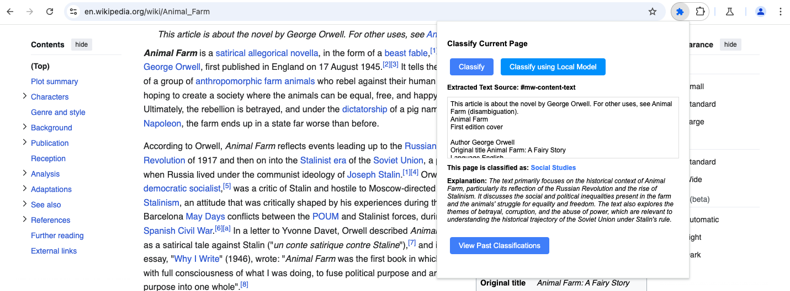
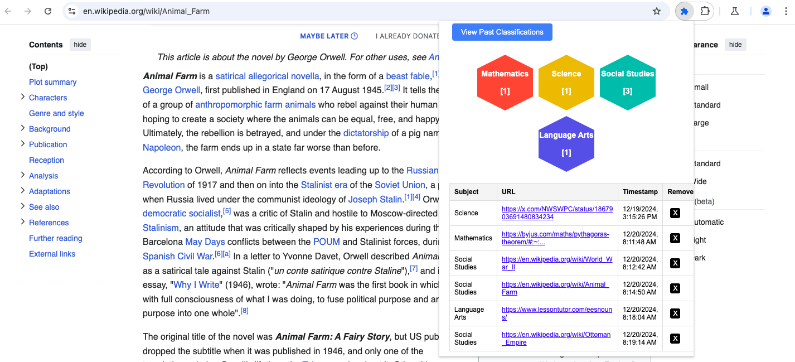

# LLM Chrome Extension

### What does this extension do?
* Uses AI to categorize any webpage content.

### Why use it?
* Easily save webpages all in one place and get a high level overview into the types of websites you visit.
* Customize it with your own AI model for tailored classifications.

### How does it work?
* Extracts webpage text using `chrome.scripting.executeScript`.
* Sends the extracted text to an AI API, which processes the data and provides a subject label.
    * The [AI model](https://huggingface.co/spaces/pleonova/subject_matter/blob/main/app.py) is containerized with Docker and hosted on Hugging Face.
* Stores classification results and webpage metadata using `chrome.storage.sync` for easy retrieval and visualization.

### How does it look?

#### Classify Button
Using Local LLM Button

#### Historical Resources

## Getting Started

*For non-developers, skip steps 1 & 2 and direcly download the `dist` folder and proceed with the remaining steps*

1. Install dependencies `npm install`
    * Make sure Node.js is installed `node -v` should display a version, otherwise if you have Homebrew `brew install node`.
2. Build the extension `npm run build`
    * This creates a `dist` folder with the **unpacked extension**. The `dist` folder is what needs to be uploaded to chrome.
3. Open the Chrome Extensions page: Type `chrome://extensions/ ` in the address bar and hit Enter.
4. Enable `Developer Mode: Toggle Developer` mode switch to on.
5. Load the extension: Click “Load unpacked” and select the extension directory's `dist` folder.
6. Confirm Loading: Extensions appear on the Extensions page.

#### No-Code Step-by-Step Setup

### Setup for Local LLM Model

1. In the browser, type the in the URL: [`chrome://flags/#text-safety-classifier`](chrome://flags/#text-safety-classifier) and select "Disabled" from the dropdown. Disabling this flag will prevent the AI generated answers from being blocked by the text safety classifier.
> **Note**: This flag is only available in Chrome Canary or Dev.
2. Open a new tab in Chrome, go to [`chrome://flags/#optimization-guide-on-device-model`](chrome://flags/#optimization-guide-on-device-model) and select "Select Enabled BypassPerfRequirement" from the dropdown.
This bypass performance checks which might get in the way of having Gemini Nano downloaded on your device.
> **Note**: If you don't see BypassPerfRequirement in the dropdown, you can try "Enabled" instead.
3. Go to [`chrome://flags/#prompt-api-for-gemini-nano`](chrome://flags/#prompt-api-for-gemini-nano) and select "Enabled" from the dropdown.
4. Relaunch Chrome.
5. Go to [`chrome://components`](chrome://components), if you see `Optimization Guide On Device Model - Version: 2024.9.25.2033
` then you are good to go. If not, click "Check for Update" on "Optimization Guide On Device Model". And wait for the update to complete.
6. Go to [`chrome://extensions`](chrome://extensions) and enable "Developer mode" at the top right.

[*Setup Instructions taken from histify repo*](https://github.com/Dnouv/histify/blob/main/README.md)
