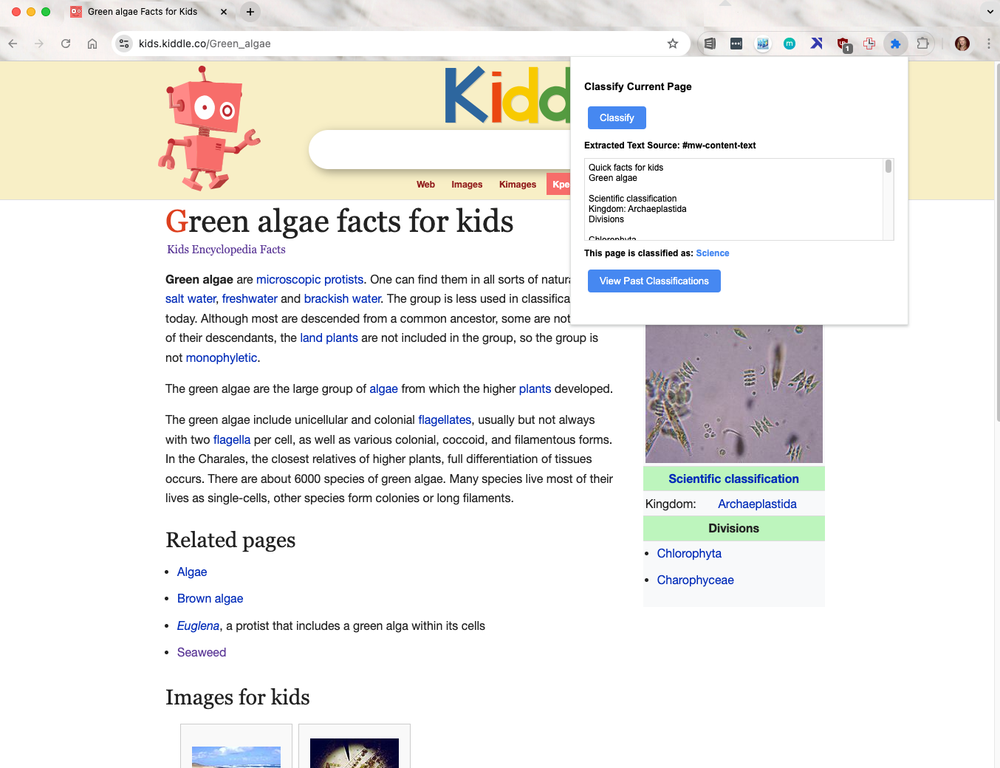

# LLM Chrome Extension

### What does this extension do?
* Uses AI to categorize any webpage content.

### Why use it?
* Easily save webpages all in one place and get a high level overview into the types of websites you visit.
* Customize it with your own AI model for tailored classifications.

### How does it work?
* Extracts webpage text using `chrome.scripting.executeScript`.
* Sends the extracted text to an AI API, which processes the data and provides a subject label.
    * The [AI model](https://huggingface.co/spaces/pleonova/subject_matter/blob/main/app.py) is containerized with Docker and hosted on Hugging Face.
* Stores classification results and webpage metadata using `chrome.storage.sync` for easy retrieval and visualization.

### How does it look?

#### Classify Button

#### Historical Resources

## Getting Started

*For non-developers, skip steps 1 & 2 and direcly download the `dist` folder and proceed with the remaining steps*

1. Install dependencies `npm install`
    * Make sure Node.js is installed `node -v` should display a version, otherwise if you have Homebrew `brew install node`.
2. Build the extension `npm run build`
    * This creates a `dist` folder with the **unpacked extension**. The `dist` folder is what needs to be uploaded to chrome.
3. Open the Chrome Extensions page: Type `chrome://extensions/ ` in the address bar and hit Enter.
4. Enable `Developer Mode: Toggle Developer` mode switch to on.
5. Load the extension: Click “Load unpacked” and select the extension directory's `dist` folder.
6. Confirm Loading: Extensions appear on the Extensions page.

#### No-Code Step-by-Step Setup

