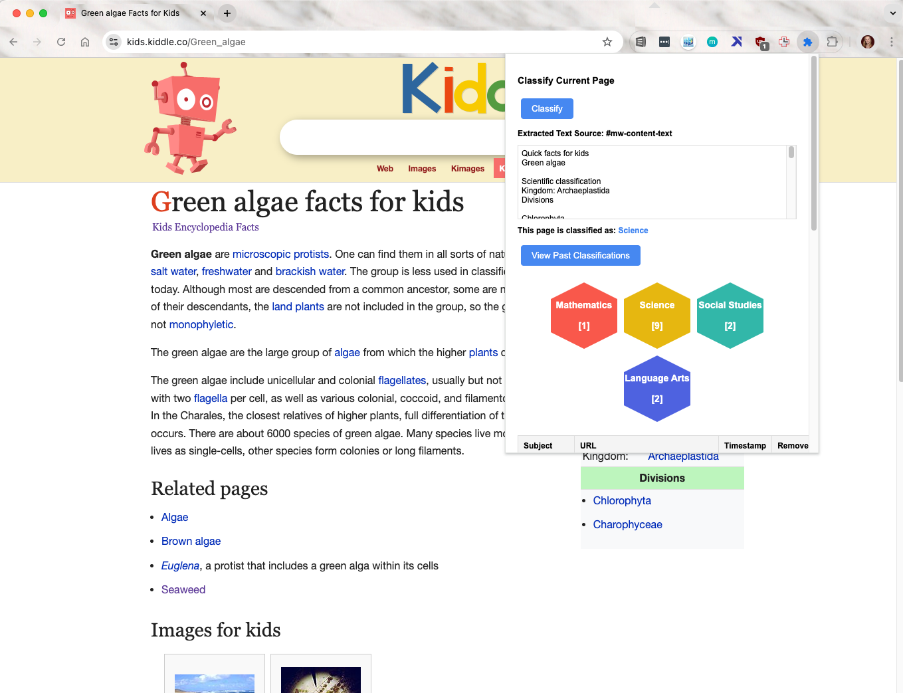
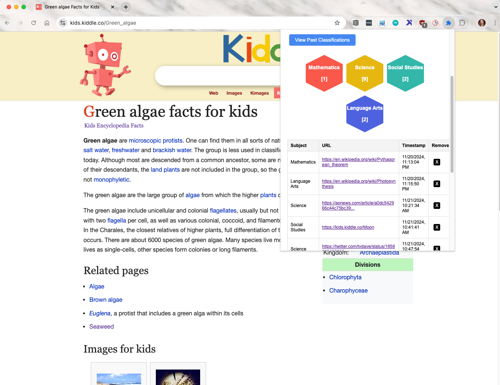
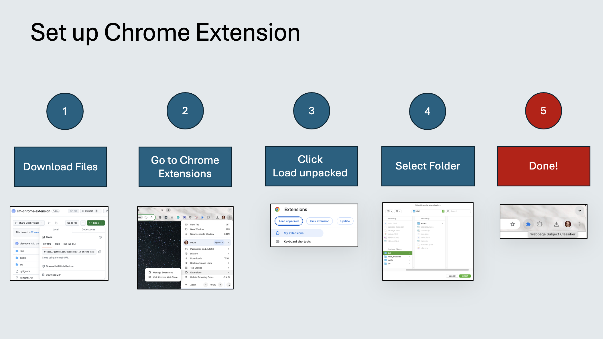

# LLM Chrome Extension

## What does this extension do?
* Uses AI to categorize any webpage with text.

## Why use it?
* Easily save webpages all in one place and get a high level overview into the types of websites you visit.

## How does it work?
* Extracts webpage text
* Sends the text to an [AI model on HuggingFace](https://huggingface.co/spaces/pleonova/subject_matter/blob/main/app.py) (easily swap out for your own model).

## How does it look?

#### Top level buttons

#### Historical Resources

## Getting Started

*For non-developers, skip steps 1 & 2 and direcly download the `dist` folder and proceed with the remaining steps*

1. Install dependencies `npm install`
    * Make sure Node.js is installed `node -v` should display a version, otherwise if you have Homebrew `brew install node`.
2. Build the extension `npm run build`
    * This creates a `dist` folder with the **unpacked extension**. The `dist` folder is what needs to be uploaded to chrome.
3. Open the Chrome Extensions page: Type `chrome://extensions/ ` in the address bar and hit Enter.
4. Enable `Developer Mode: Toggle Developer` mode switch to on.
5. Load the extension: Click “Load unpacked” and select the extension directory's `dist` folder.
6. Confirm Loading: Extensions appear on the Extensions page.

### No-Code Step-by-Step Setup

